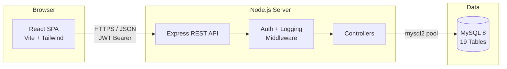

CorpLink follows a **classic 3-tier architecture**: React SPA → Express REST API → MySQL.

## High-Level Diagram

## Request Lifecycle

<Steps>
  <Step title="User action in React">
    A component (e.g. `Dashboard.jsx`) calls a service function in `src/services/`, which uses Axios to hit the API.
  </Step>
  <Step title="Express receives the request">
    `server.js` routes `/api/*` to the matching router (`routes/auth.js`, `routes/dashboard.js`, etc.).
  </Step>
  <Step title="Middleware runs">
    `requestLogger` logs the request, then `authenticate` validates the JWT and attaches the user to `req.user`.
  </Step>
  <Step title="Controller executes">
    Controllers in `backend/src/controllers/` run validators, query MySQL via the pool, and respond with JSON.
  </Step>
  <Step title="Frontend updates state">
    The component updates its React state and re-renders. `AuthContext` persists the user/token across refreshes via `localStorage`.
  </Step>
</Steps>

## Key Design Decisions

<CardGroup cols={2}>
  <Card title="JWT, not sessions" icon="key">
    Stateless tokens with a 7-day expiry. A `user_sessions` table mirrors active tokens for audit purposes.
  </Card>
  <Card title="Role-Based Access Control" icon="user-shield">
    Three roles (Admin / Manager / Employee) checked in both backend middleware and `ProtectedRoute` on the frontend.
  </Card>
  <Card title="Vite + React 18" icon="bolt">
    Fast HMR, ES modules, and tree-shaking for a snappy dev loop.
  </Card>
  <Card title="MySQL Connection Pool" icon="database">
    Backend uses `mysql2` with a shared pool for predictable concurrency.
  </Card>
</CardGroup>

## Related

- [Tech Stack](/architecture/tech-stack)
- [Project Structure](/architecture/project-structure)
- [Database Schema](/development/database)
