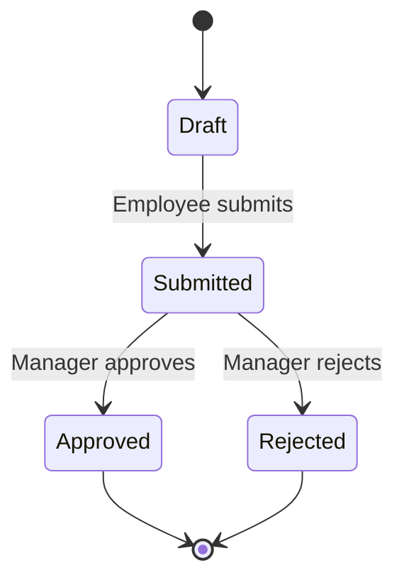

The `Leave.jsx` page handles paid/unpaid leave requests with a manager approval workflow.

## Workflow

## Leave Types

- **Casual Leave (CL)**
- **Sick Leave (SL)**
- **Earned / Vacation Leave (EL)**
- **Compensatory Off (COff)**
- **Unpaid Leave**

## Permissions

| Action | Employee | Manager | Admin |
|--------|----------|---------|-------|
| Submit own request | ✅ | ✅ | ✅ |
| View own leave balance | ✅ | ✅ | ✅ |
| View team requests | ❌ | ✅ | ✅ |
| Approve / Reject | ❌ | ✅ | ✅ |
| Edit leave policy | ❌ | ❌ | ✅ |

## Source

`frontend/src/pages/Leave.jsx`

<Note>
  Approval endpoints arrive in **Phase 3**. UI currently uses mock data plumbed through `services/`.
</Note>
