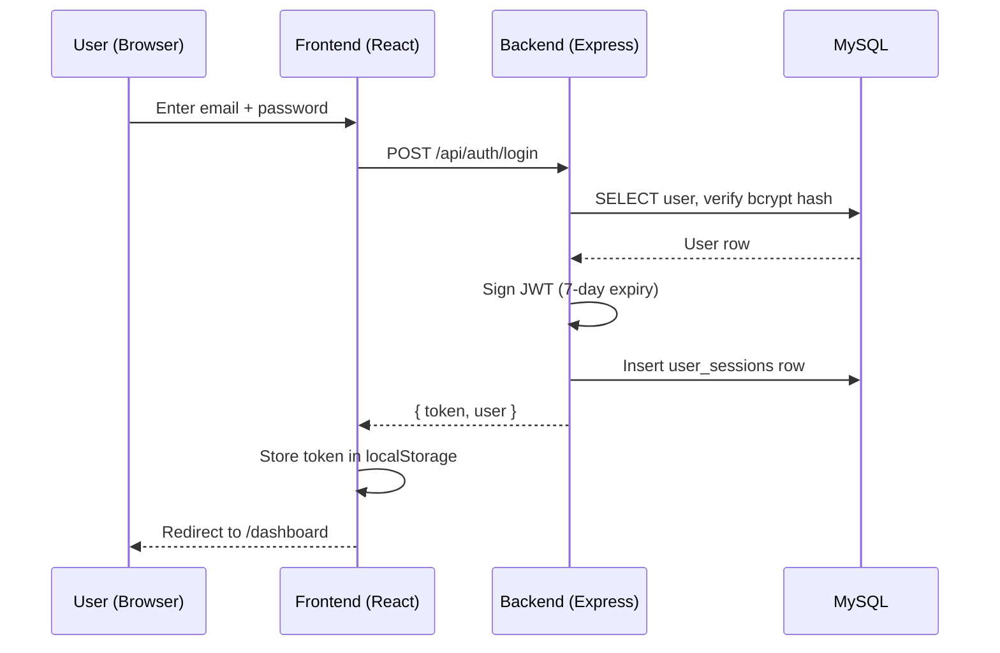

The seed scripts create three accounts representing each role.

<Warning>
  These accounts are for **local development only**. Never deploy them to production. Rotate `JWT_SECRET` and recreate users before going live.
</Warning>

## Accounts

| Role | Email | Password |
|------|-------|----------|
| **Admin** | `john.smith@company.com` | `password123` |
| **Manager** | `sarah.johnson@company.com` | `password123` |
| **Employee** | `michael.chen@company.com` | `password123` |

## What Each Role Can Do

<Tabs>
  <Tab title="Admin">
    - View all users and edit all data
    - Delete records
    - Manage user accounts and roles
    - Access every feature module
  </Tab>
  <Tab title="Manager">
    - View team members' data
    - Approve leave requests
    - Conduct performance reviews
    - Edit team-level records
  </Tab>
  <Tab title="Employee">
    - View own profile and data
    - Submit leave requests, timesheets, expenses
    - View announcements, policies, holidays
    - Limited read-only access to most modules
  </Tab>
</Tabs>

## Login Flow

See [Authentication API](/api-reference/auth) for endpoint details.
