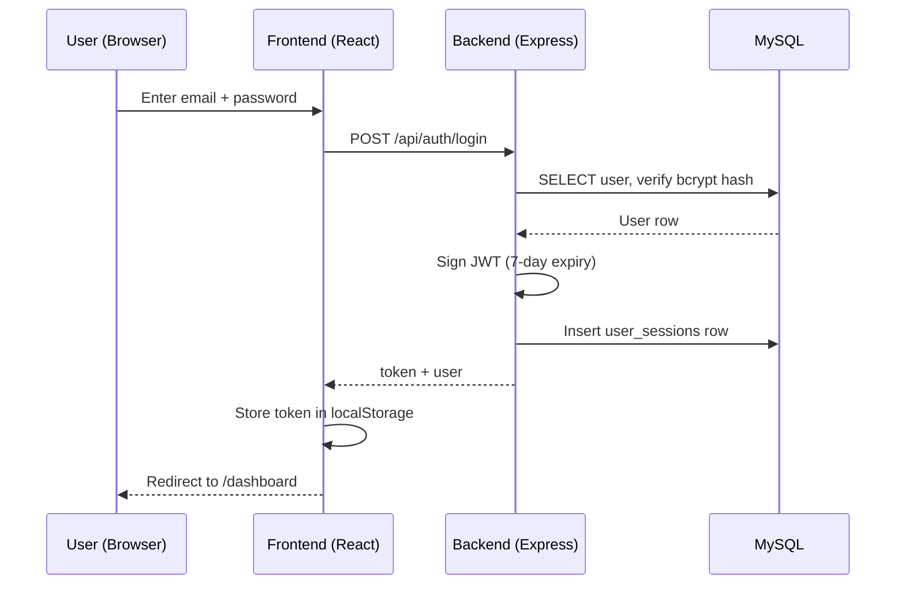

import Tabs from '@theme/Tabs';
import TabItem from '@theme/TabItem';

# Demo Credentials

The seed scripts create three accounts representing each role.

:::warning
These accounts are for **local development only**. Never deploy them to production. Rotate `JWT_SECRET` and recreate users before going live.
:::

## Accounts

| Role | Email | Password |
|------|-------|----------|
| **Admin** | `john.smith@company.com` | `password123` |
| **Manager** | `sarah.johnson@company.com` | `password123` |
| **Employee** | `michael.chen@company.com` | `password123` |

## What Each Role Can Do

<Tabs>
<TabItem value="admin" label="Admin" default>

- View all users and edit all data
- Delete records
- Manage user accounts and roles
- Access every feature module

</TabItem>
<TabItem value="manager" label="Manager">

- View team members' data
- Approve leave requests
- Conduct performance reviews
- Edit team-level records

</TabItem>
<TabItem value="employee" label="Employee">

- View own profile and data
- Submit leave requests, timesheets, expenses
- View announcements, policies, holidays
- Limited read-only access to most modules

</TabItem>
</Tabs>

## Login Flow

See [Authentication API](/docs/api-reference/auth) for endpoint details.
