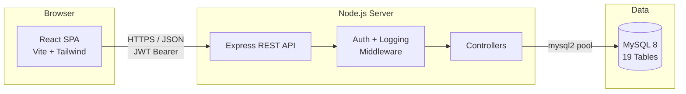

# Architecture Overview

CorpLink follows a **classic 3-tier architecture**: React SPA → Express REST API → MySQL.

## High-Level Diagram

## Request Lifecycle

### 1. User action in React
A component (e.g. `Dashboard.jsx`) calls a service function in `src/services/`, which uses Axios to hit the API.

### 2. Express receives the request
`server.js` routes `/api/*` to the matching router (`routes/auth.js`, `routes/dashboard.js`, etc.).

### 3. Middleware runs
`requestLogger` logs the request, then `authenticate` validates the JWT and attaches the user to `req.user`.

### 4. Controller executes
Controllers in `backend/src/controllers/` run validators, query MySQL via the pool, and respond with JSON.

### 5. Frontend updates state
The component updates its React state and re-renders. `AuthContext` persists the user/token across refreshes via `localStorage`.

## Key Design Decisions

| Decision | Rationale |
|----------|-----------|
| 🔑 **JWT, not sessions** | Stateless tokens with a 7-day expiry. A `user_sessions` table mirrors active tokens for audit purposes. |
| 🛡️ **Role-Based Access Control** | Three roles (Admin / Manager / Employee) checked in both backend middleware and `ProtectedRoute` on the frontend. |
| ⚡ **Vite + React 18** | Fast HMR, ES modules, and tree-shaking for a snappy dev loop. |
| 🗄️ **MySQL Connection Pool** | Backend uses `mysql2` with a shared pool for predictable concurrency. |

## Related

- [Tech Stack](/architecture/tech-stack)
- [Project Structure](/architecture/project-structure)
- [Database Schema](/development/database)
